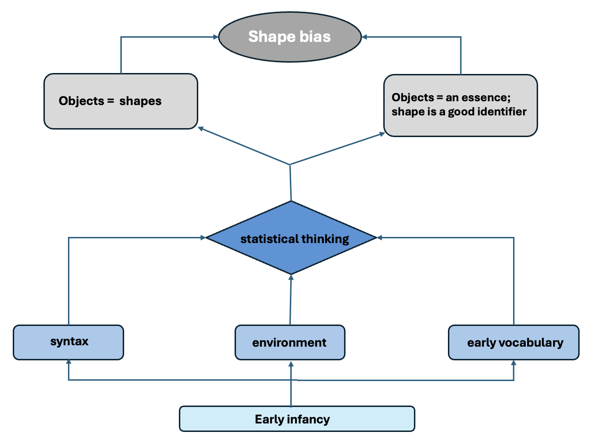

```{r global_options, include=FALSE}
knitr::opts_chunk$set(fig.width=3, fig.height=3, fig.crop = F, 
                      fig.pos = "tb", fig.path='figs/',
                      echo=F, warning=F, cache=F, 
                      message=F, sanitize = T)
```

```{r, libraries}
library(png)
library(grid)
library(ggplot2)
library(xtable)
library(here)
source(here("packages.R"))
source(here("preprocessing.R"))
source(here("Basic_parad.R"))

```
# Basis of generalizations
What does "dog" mean to a 2-year-old? This old question reflects the evolving nature of our understanding of early label categorization. For young children, a dog might initially be identified by a set of general features that expands with experience. For example, The semantic features hypothesis (@Clark1973WHATSIA) suggests that categorization begins with schemas of basic perceptual attributes, such as [four legs, tail, fur] for dog, hence we see overextensions of the word “dog” to beings that share these set of features like cats for example. Over time, deeper attributes, such as its internal composition, behavior and interaction with the world, or sound, may also become relevant. In contrast, the functional core hypothesis [@Nelson1974ConceptWA] posits that children extract relationships among features to identify future category members without treating these features as defining. In this view, perceptual attributes like [four legs, tail, fur] act as identifiers rather than encapsulating the category's essence. Both frameworks agree, however, that shared perceptual features facilitate identification and labeling, forming the foundation for the well-studied shape bias (@Baldwin1992ClarifyingTR; @Graham1999InfantsRO ; @LANDAU1988299 ; @graham_2010, @samuelson2000children; @imai_childrens_1994).

The shape bias, which is the tendency to generalize objects names by their shape, rather than other properties, is a word learning constraint that is argued to facilitate early noun acquisition, to be an important route to vocabulary growth, and to be weaker in children with language delay [@smith_object_2002; @Jones2003; @JONES_SMITH_2005; @TekAutism ; @TekAutismLessons]. Nevertheless, the shape bias observed in word learning experiments is highly variable across ages, cultures, languages, and experimental conditions, leading to conflicting outcomes and difficulties integrating the state of evidence to assess its commensurability and form a coherent understanding of the phenomenon of label categorization [ @Kucker2019ReproducibilityAA]. 

A recent meta-analytic effect size of 0.8, derived from over 300 standardized effects across 40 studies [@abdelrahim_frank_2024], confirms the robustness of the shape bias. However, substantial heterogeneity in the data (with over 90% of variance unexplained by age or language) suggests that cross-cultural, linguistic, and developmental differences remain masked.

# Theorectical implications
The investigation of the shape bias, and label categorization more broadly, has unfolded around two major debates: a cross-cultural debate and a representational debate.

## Cross-linguistic debate
The word extension task literature highlights significant cross-linguistic differences in the prevalence of the shape bias, which are considered theoretically important. For example, speakers of East Asian languages like Mandarin and Japanese demonstrate less reliance on shape when extending nouns compared to English speakers in the United States [@Smith2003MakingAO; @gathercole_1997; @imai1997; @samuelson1999; @soja1991ontological; @subrahmanyam_2006; @yoshida2003].

Two key hypotheses attempt to explain these differences:
1- Syntactic Structure Hypothesis: Differences in linguistic structure, such as count-mass syntax in English versus classifier systems in East Asian languages, influence the prevalence of the shape bias [@imai1997; @samuelson2008rigid; @soja1991ontological; @soja_perception_1992]. 

2- Statistical Regularities Hypothesis: Variations in lexical and environmental statistical regularities tunes attention toward features like shape. This hypothesis emphasizes the role of existing vocabulary and environmental exposure in guiding category organization [@gershkoff2004shape; @samuelson_statistical_2002; @samuelson1999; @perry2010learn; @colunga2000learning; @yoshida2003known; @2005_Samuelson; @jara2022; @abdelrahim_frank_2024]. 

## The Perception or conception debate
A second key debate focuses on the mechanism or representation underlying the shape bias. While the tendency to extend nouns based on shape may be influenced by syntax or statistical regularities, its precise cognitive basis has been controversial [@smith_object_2002; @smithcolunga2010; @Smith1996NamingIY; @SAMUELSON2010138; @WARE2010124; @dejavu ; @JONES1993113; @dynamicBias; @Bruner1964TheCO; @gelman_medin1993].

Two competing perspectives attempt to explain this mechanism:

1- Associative and Non-Strategic Mechanism:
The shape bias is viewed as an early cognitive tool, helping children "break into" language by rapidly mapping nouns to referents through associative processes. This bias operates on a perceptual level, organizing categories around salient features like shape. For instance, the shape of a dog becomes synonymous with the category "dog" i.e. a real dog and a plastic toy dog have the same mental representation. 
This view posits that the bias is non-strategic, independent of conceptual understanding or general world knowledge (@gentner1978; @SMITH1996143). 

2- Strategic and Conceptually Controlled Mechanism:
The shape bias is seen as a flexible and controlled process, governed by general world knowledge and conceptual understanding [@BOOTH2002B11; @2005_Booth]. Although a real dog and a plastic toy dog are both referents of the same label, but they have different mental representations. 
In this framework, the bias is a heuristic that can be overridden when context or conceptual goals require attention to other features, such as function or material.
```{r flow_diagram , fig.height = 2, fig.width =2, out.width="100%", fig.cap="A diagram to visualize different factors that potentially contribute to the emergence of the shape bias"}


```
## The nature of Knowledge
Given that task design is influenced by theoretical assumptions, this raises another important question: What type of knowledge do these tasks measure? Two key assumptions can stem out of this:

Knowledge as Stable and Fixed: If knowledge is stable, tasks merely elicit pre-existing constructs. Investigating heterogeneity would then focus on ensuring task validity and reliability in capturing the theoretical construct.

Knowledge as Dynamic and Task-Dependent: If knowledge is dynamic, categorization depends on the interaction between task specifics and children’s behavior. This view suggests that children dynamically select information sources to organize categories, influenced by the context of the task and the nature of the stimuli [@smithContext; @replycimpian; @cimpian2005absence; @smithcolunga2010]. If the second assumption holds, achieving consistency in measures across studies is crucial to isolating the relevant contextual cues that tasks provide specially for cross-cultural studies that aim to adjudicate theoretical debates.

Regardless of which assumption holds, it is necessary to evaluate the heterogeneity in the word categorization studies which highlights the importance of methodological consistency and the need to consider the theoretical premises underlying procedural decisions. Understanding how these premises shape task designs and influence results is key to advancing our knowledge of label categorization and concept formation. 

# Sources of Heterogeneity
The unexplained variability across studies and experiments are suggested to be due to procedural variation i.e. task format and stimuli. 

## Task format
Generalization in word learning is assessed by teaching children a novel label for a novel object, and then test them on the ability to extend it to other objects that share features like shape, or material, etc, with the exemplar object. Word extensions are measured via Forced-choice tasks, which require restrictive generalizations, yes/no endorsement tasks, allowing broader acceptance of category membership which allows for different levels of similarity and difference [@LANDAU1988299], or Open-choice tasks, enabling children to reject all options, which is interpreted as an indication of an understanding of category membership that goes beyond shared perceptual features. It is not yet clear how different tasks affect performance. For example, allowing children to select "none of those" reduces shape bias, especially with complex objects [@cimpian2005absence]. The choice of the task format is often guided by the theoretical framework of the researchers, leading to what seems like a circular stream of events in which theory informs task selection, and task selection confirms theory.

## Stimuli
A significant sources of variation in the word extension findings comes from differences in stimuli. Just like task format, these methodological decisions are often driven by theoretical frameworks as well. 
For instance, studies focusing on low-level attentional biases typically emphasize contrasts between shape and other perceptual features, such as color or material, using stimuli designed to highlight these attributes. On the other hand, studies investigating conceptual understanding often include cues related to animacy, such as eyes, shoes, or other salient features, and use test objects that share multiple dimensions with the exemplar instead of only one to explore broader conceptual frameworks [@yoshida2003; @JONES1998323].
When functionality is emphasized, stimuli are often paired with demonstrations of an affordance, stories, or narratives to contrast shape with function. Children aged 2 to 5 years are found to prioritize shape, even when provided with functional information [@Centner2003OnRM; @landau1996; @Merriman_Scott_Marazita_1993; @GRAHAM1999128]. However, conflicting evidence shows children sometimes prioritize function or other cues (@KEMLERNELSON199977; @KEMLERNELSON1995347; @Nelson2000). This variation is linked to factors like whether test objects were handled or how stimuli were designed (e.g., functional bases vs. appended parts). In addition, some studies use pictures or drawings, while others use physical objects (cite). 

Lastly, most studies employ between-subjects designs, which do not control for individual differences, further amplifying heterogeneity. These procedural and stimuli variations reflect broader theoretical questions about the origins of the shape bias (Smith & Medin, 1981). Is it a Low-level attentional mechanisms driven by attentional processes that guide children to perceptual features associated with category labels? Or a Top-down conceptual processes in which the perceptual features act as identifiers rather than defining properties? Where should the line be drawn between perceptual feature identification and the core representation of conceptual labels? Are these separate processes, or do they exist on a continuum that develops as children acquire more information? How do attention to perceptual attributes and conceptual understanding interact during development (Madole & Oakes, 1999)? These foundational questions influence procedural decisions and should be kept in mind when investigating label categorization and concept formation.

# Current Study
This project seeks to evaluate procedural sources of variability as part of a larger scale assessment of word generalization across age groups and languages. 
We utilize a within-subject design, controlling for individual differences which we believe is important for a proper comparison between conditions that require giving different instructions and cues to the participants. We aim to recruit a larger sample size of a wider age group, with a variety of items and test trials. 
Given our focus on early language acquisition and the noun bias dominating early vocabulary [@frank2021], we prioritize studies examining functional information over other types of conceptual knowledge. 

## Stimuli design
To investigate children’s reasoning about objects' properties and functions, a series of object sets were designed, each containing one exemplar, a material match, a shape match, a function match, and a distractor (e.g., dax, fep, blicket, gorp, zimbo, wap, blint). These sets allowed for systematic manipulation of object features to assess various cognitive processes related to word learning and category generalization.
In Experiment 1, the shape match was contrasted with a material match. This served as a baseline check and replication of prior findings regarding shape bias in categorization tasks.
In Experiment 2, the same exemplar was used, but the shape match was contrasted with a function match. 
```{r stimulipics , fig.height = 0.5, fig.width =0.5, out.width="100%", fig.cap="Examples of stimuli objects used in both experiments"}
knitr::include_graphics("stimuli.png")
```
The function test object was modified in a way that preserved its shape but altered its functionality (e.g., an object wrapped entirely vs. one that could clearly open).
Color was excluded across all objects to ensure that visual similarity was driven solely by shape, material, and functional cues.
Objects were crafted to explore how children reason about similarity based on whole-object vs. part-based features (e.g., whether specific parts afford a function).
Some objects, like the "Fep," "blint," and "wap," were designed with material-critical functions (e.g., holding water while made of a paper towel). This design tested whether children could prioritize material when reasoning about function and to capture the developmental changes.
The degree to which object affordances were visually apparent varied across designs. For example, The "Zimbo" was designed to afford functionality only through a specific part, while the overall structure was irrelevant.
The "Gorp" was modeled to resemble objects familiar to slightly older children, like scissors, allowing exploration of prior experiences' influence on categorization. This variability was accounted for using mixed-effects modeling, enabling the examination of how children’s responses were influenced by object features and individual differences. (An adult similarity rating experiment is currently underway to measure perceived similarity between objects.)

# Experiment 1:

## Participants
Twenty four typically developing English speaking participants (2-5 years old, mean=`r round(mean(df_summer24$age),2)`, SD=`r round(sd(df_summer24$age),2)`) were recruited from a local nursery school and children’s museum in the US (preregistration link).

## Procedure
Seven trials were conducted in which each participant sees an object being labeled “this is a dax”, the object is taken away but still in view, both test objects and the distractor are displayed simultaneously while asking the child “can you find another dax by pointing to it?”. The child gets to hear the label 3 times while viewing it without touching it. 
``` {r first_exp, fig.width = 6, fig.height= 4, out.width = "100%", fig.cap = "Developmental trend of choosing by each dimension. Smoothed lines are standard error. Distractor is no match at all. Data points are individual participants"}
ggplot(data = kid_means_long_summer24, aes(x = age, y = proportions, color = response)) +
  geom_jitter(position=position_jitter(height=0))+
  geom_smooth() +
  theme_minimal() +
  xlab("Age (mo)") + ylab("Proportion selected") + labs(color = "Dimension") +
  scale_color_manual(labels = c("distractor", "material","shape" ), values = c("brown", "darkgrey", "yellow4")) +
  theme(legend.position = "bottom") 

```

``` {r first_exp_stim, fig.width = 6, fig.height= 4, out.width = "100%", fig.cap = "Percentage of choosing by dimension per stimuli item, indicated by its novel label (aggregate across participants). Dashed line is chance level = 33.3% "}

# Reorder standardlabel by "shape" percentage in descending order
plot_data_summer24 <- plot_data_summer24 %>%
  mutate(standardlabel = fct_reorder(standardlabel, 
                                     percent * (response == "shape"), 
                                     .desc = TRUE))

ggplot(data = plot_data_summer24, aes(x = standardlabel, y = percent, fill = response)) +
  geom_col(position = "stack", color = "black") +  
  geom_hline(yintercept = 33.3, linetype = "dashed") +
  geom_hline(yintercept = 66.6, linetype = "dashed") +
  theme_minimal() +
  xlab("Stimuli object (by exemplar label)") +
  ylab("Selection Percentage") +
  labs(fill = "Response") +
  scale_fill_manual(
    values = c("brown", "darkgrey", "yellow4"), 
    labels = c("Distractor", "Material", "Shape")  # Legend labels
  ) +
  theme(
    axis.text.x = element_text(angle = 45, hjust = 1),
    legend.title = element_text(size = 12, face = "bold"),
    legend.text = element_text(size = 10),
    legend.position = "bottom",  # Place legend at the bottom
    panel.grid.major.y = element_line(color = "grey90")
  ) +
  geom_text(aes(label = round(percent, 1)),
            position = position_stack(vjust = 0.5),  
            color = "white",  
            size = 2.5)  
```
## Analysis
We use a generalized logistic mixed effects model predicting a binary outcome of choosing by shape. Random intercepts at the level of both participants and stimuli objects. 

## Results

Participants showed an overall shape bias across all trials (shape:61%, material:30%, distractor: 9%). Figure \ref{fig:first_exp} shows a developmental shift to choose by shape by age 3, replicating what is seen previously in the literature.  
A generalized logistic mixed-effects model (GLMM) reveals an average intercept odds of `r round(exp(fixef(gmodel1)["(Intercept)"]), 2)` (odds of `r round(exp(fixef(gmodel1)["(Intercept)"]), 2)`:1 at the mean age, $p=$ `r papaja::apa_p(summary(gmodel1)$coefficients["(Intercept)", "Pr(>|z|)"])`), with a significant increase in odds of `r round(exp(fixef(gmodel1)["age"]), 2)` per unit increase in age ($p=$ `r papaja::apa_p(summary(gmodel1)$coefficients["age", "Pr(>|z|)"])`). The model also shows variability at the item-level intercept (variance = `r round(VarCorr(gmodel1)$standardlabel[1, 1], 2)`, SD = `r round(sqrt(VarCorr(gmodel1)$standardlabel[1, 1]), 2)`) across `r length(unique(df$standardlabel))` unique items (standardlabel groups).

## Discussion:
Overall, even within this small sample of children between 2 and 5 years of age, data from this experiment confirmed the robustness of the shape bias. Although the reason why the younger group of kids i.e. below 3, chose more by material is not clear now, however, we see variability at the item level such that for three objects "blicket, dax, and wap" we see an above chance material choices when collapsing across ages.
After replicating the shape bias effect using the set of stimuli we created in a simple set up, our next experiment explores a design that tests for two conditions. The first is when shape is only contrasted with material without any additional information. The second is a condition in which shape is contrasted with function after demonstrating the function for the exemplar, while controlling for individual differences with a bigger sample size to capture variability at the item level as well as any potential individual differences.

# Experiment 2
## Participants

31 (target n=96, 24 per each age group) participants between 2-5 years old (mean=`r round(mean(df$age_mo),2)`, SD=`r round(sd(df$age_mo),2)`, n per age group) were recruited from a local nursery school in the US.

## Procedure

A within subject manipulation with two conditions: material or function. The material condition is identical to the first experiment. In the function condition, the experimenter introduce the exemplar object “this is a dax”, gives the child 15 seconds seconds to play with it, provides functional information “ the dax grapes toys”, gives another 15 seconds to play with it, and puts the toy away but within view, before introducing the test objects and asks for a response. 
``` {r jitter_function, fig.env = "figure*", fig.width = 8, fig.height= 4, fig.pos = "!h",  out.width = "100%", fig.cap = "Experiment 2, function vs. no function condition. Smoothed lines are standard error. Distractor is no match at all. Data points are individual participants. Children choose by shape more, even when function information is made salient."}

kid_means_long <- kid_means_long %>%
  mutate(condition = recode(condition, 
                            "function" = "Function", 
                            "material" = "No Function"))
# conditions <- c(
#   "Function" = "Function",
#   "No Function" = "No Function"
# )

ggplot(data = kid_means_long %>% filter(!(condition == "Function" & response == "m.mean") , !(condition == "No Function" & response == "f.mean")), aes(x = age_mo, y = proportions, color = response)) +
  geom_jitter(position=position_jitter(height=0)) +
  facet_wrap(~condition) +
  geom_smooth(method = "lm") +
  theme_minimal() +
  xlab("Age (mo) ") +
  ylab("Proportion selected") +
  labs(color = "Response") +  # Label for the legend
  scale_color_manual(
    values = c("brown", "darkgrey", "yellow4", "pink"),  # Colors for each response
    labels = c("Distractor", "Function", "Material", "Shape")  # Labels for the legend
  ) + 
  theme_minimal() + 
  theme(legend.position = "bottom")


#ggsave("jitter.png", width = 12, height = 8, dpi = 300)

```

``` {r sec_exp_stim, fig.width = 6, fig.height= 4, out.width = "100%", fig.cap = "Experiment 2, proportion of choosing by each dimension per exemplar item, indicated by its novel label(aggregate across participants). Dashed line is chance level = 33.3%. We note variability across items."}

plot_data_c <- plot_data_c %>%
  mutate(condition = recode(condition, 
                            "function" = "Function", 
                            "material" = "No Function"))
conditions <- c(
  "Function" = "Function",
  "No Function" = "No Function"
)


ggplot(data = plot_data_c %>% filter(!(condition == "Function" & response == "material")), aes(x = standardlabel, y = percent, fill = response)) +
  geom_col(position = "stack", color = "black") + 
  geom_hline(yintercept = 33.3, linetype = "dashed") +
  geom_hline(yintercept = 66.6, linetype = "dashed") +
  theme_minimal() +
  xlab("Stimuli object (by exemplar label)") +
  ylab("Selection Percentage") +
  labs(fill = "response") +
  scale_fill_manual(
    values = c("brown", "darkgrey", "yellow4", "pink"),  #enough colors for all response categories
    labels = c("distractor", "function", "material", "shape")  # labels match the responses
  ) +
  facet_wrap(~ condition, labeller = as_labeller(conditions))  + 
  theme(
    axis.text.x = element_text(angle = 45, hjust = 1),
    legend.title = element_text(size = 12, face = "bold"),
    legend.text = element_text(size = 10),
    legend.position = "bottom",  
    panel.grid.major.y = element_line(color = "grey90")
  ) +
  geom_text(aes(label = round(percent, 1)),
            position = position_stack(vjust = 0.5),  # Center labels inside the bar segments
            color = "white", 
            size = 2.5)  
```

```{r finalmodel, echo=FALSE}

gmodel <- glmer(b_response ~ mean_age * condition + (1 | kidid) + (1 | standardlabel),
      family = binomial(link = "logit"), data = df)
#gmodel
#confint(gmodel, method = "profile") # Profile likelihood method

gmodel_summary <- summary(gmodel)
coefficients_gmodel <- gmodel_summary$coefficients
mdlcoeff <- list(coeff = coefficients_gmodel[, "Estimate"], pval = coefficients_gmodel[, "Pr(>|z|)"])

```

``` {r include = FALSE, echo=FALSE}
# Extract additional coefficients for a scatter plot
standardlabel_intercepts <- coef(gmodel)$standardlabel[, "(Intercept)"]

summary_statistics <- data.frame(
  Mean = mean(standardlabel_intercepts),
  SD = sd(standardlabel_intercepts),
  Min = min(standardlabel_intercepts),
  Max = max(standardlabel_intercepts)
)

intercepts_data <- data.frame(
  StandardLabel = rownames(coef(gmodel)$standardlabel),
  Intercept = standardlabel_intercepts,
  MeanAge = coef(gmodel)$standardlabel[, "mean_age"]
)

# Scatter plot of Intercept vs. MeanAge
ggplot(intercepts_data, aes(x = MeanAge, y = Intercept, color = StandardLabel)) +
  geom_point( size = 3) +
  geom_smooth(method = "lm", se = FALSE, color = "red") +
  labs(
    title = "Intercept vs. MeanAge",
    x = "Mean Age Coefficient",
    y = "Intercept"
  ) +
  theme_minimal()

```

## Preliminary results
Similar to what is conveyed in Figure \ref{fig:jitter_function}, a generalized logistic mixed-effects model (GLMM) showed a lower baseline odds of the shape bias in the material condition compared to the function, and the odds ratio increases with age. In additon, random effects indicate variability in intercepts across participants (SD = `r round(sqrt(VarCorr(gmodel)$kidid[1, 1]), 2)`) and across items (SD = `r round(sqrt(VarCorr(gmodel)$standardlabel[1, 1]), 2)`) for `r length(unique(df$kidid))` participants and `r length(unique(df$standardlabel))` items as in Figure \ref{fig:sec_exp_stim}. (Notably, the confidence intervals show uncertainty "include 0", however data collection is still ongoing.)

# Discussion
The word extension and category organization literature is highly heterogeneous. Studies in this domain lack an integrative and commensurable design, which hinders our ability to draw consistent conclusions. To achieve a more accurate measurement of category organization and concept learning, we need a reliable and valid range set of stimuli objects, consistent task formats and test designs, as well as multi-site cross-cultural experiments unified across laboratories to maximally account for the variability.
Our evaluation of the word extension literature reveals that making procedural decisions, which we think are likely a primary source of unexplained variability, is unattianable without running a series of controlled experiments that would allow us to systematically assess how different designs and stimuli covary with response patterns. 

In our preliminary results, we see a tendency to generalize by shape, even in conditions designed to make function salient. This suggests that, even with a potential saliency effect, where the trials highlighted functional information, it failed to override the preference for shape-based choices.
In addition, many children explored whether their chosen test object could perform the intended function after selecting it based on shape. This behavior implies that the shape-based selection might not reflect a disregard for functional information but rather a hypothesis that objects sharing shape might also share functionality (for example, in the case of the dax, which is a box with lid that you can use to store small toys, kids choose another box that is wrapped all over to indicate impossibilty to open, and they still try to open it afterwards). 
Meanwhile, in the case of the (gorp), for which the function wasn't as ambiguous (scooping sand requires the structure of the object to have two parts that can split and then close to hold sand inside), in this case the test object was designed in a way that makes it very clear to not open, hence they went for the function test choice (see suplementary material). 
For evaulating the children's ability to reason about intrinsic affordances, we created the "Fep" in a way such that the material itself is very critical for performing the function "holding water while being made of paper towel". We believe all these structural differences between objects can explain part of the variation when we have enough data to fit the model. 

As we mentioned in the introduction, procedural variation observed in the literature have followed theoretical debates and in fact reinforced by them. We think this endeavor is one step towards achieving validity and reliability in word extension tasks, as well as discussing theoretical implications that follow (@madole1999263). To illustrate, the definition of the shape bias construct as a word extension strategy has been ambiguous and it is also influenced by theoretical framing. For example, if it is a product of different contingencies and statistical regularities, it would make sense from a signal detection point of view, to predict that it will have a graded degree between population, individuals, and items. Hence, analyzing data on an aggregate level across all these dimensions hasn't helped advancing our understanding of cross cultural differences at a theoretical level. 
We believe, providing a quantifiable assessment of data across items, individuals, and building upon that across cultures, will be the only way to resolve these issues.


# References 

```{r}
# References will be generated automatically by Pandoc and included here.
# The following code is some latex to format the bibliography. Do not remove it.
```

\setlength{\parindent}{-0.1in} 
\setlength{\leftskip}{0.125in}
\noindent
