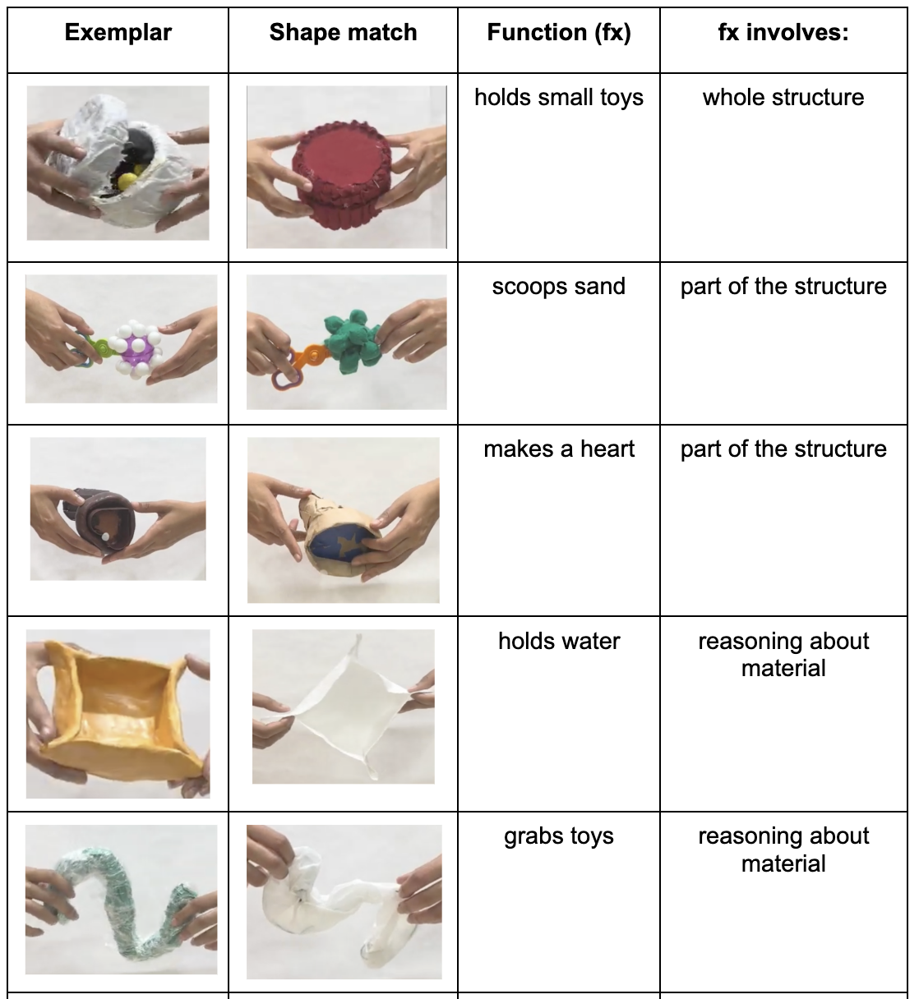

```{r global_options, include=FALSE}
knitr::opts_chunk$set(fig.width=3, fig.height=3, fig.crop = F, 
                      fig.pos = "tb", fig.path='figs/',
                      echo=F, warning=F, cache=F, 
                      message=F, sanitize = T)
```

```{r, libraries}
library(png)
library(grid)
library(ggplot2)
library(xtable)
library(tidyverse)
library(here)
library(lme4)  
library(papaja)
library(knitr)        # for knitting RMarkdown 
```
What does "dog" mean to a 2-year-old? This old question reflects the evolving nature of our understanding of early label categorization. For young children, a dog might initially be identified by a set of general features that expands with experience. For example, The semantic features hypothesis @Clark1973WHATSIA suggests that categorization begins with schemas of basic perceptual attributes, such as [four legs, tail, fur] for dog, hence we see overextensions of the word “dog” to beings that share these set of features like cats for example. Over time, deeper attributes, such as its internal composition, behavior and interaction with the world, or sound, may also become relevant. In contrast, the functional core hypothesis [@Nelson1974ConceptWA] posits that children extract relationships among features to identify future category members without treating these features as defining. In this view, perceptual attributes like [four legs, tail, fur] act as identifiers rather than encapsulating the category's essence. Both frameworks agree, however, that shared perceptual features facilitate identification and labeling, forming the foundation for the well-studied shape bias (@Baldwin1992ClarifyingTR; @Graham1999InfantsRO; @LANDAU1988299; @graham_2010, @samuelson2000children; @imai_childrens_1994).

What does "hammer" mean to a toddler? One possibility is that "hammer" refers to other hammer-shaped objects. The *shape bias* is the tendency to generalize objects names by their shape, rather than other properties. The presence of a shape bias is argued to facilitate early noun acquisition, to be an important route to vocabulary growth, and to be weaker in children with language delay [@smith_object_2002; @Jones2003; @JONES_SMITH_2005; @TekAutism ; @TekAutismLessons]. The shape bias is typically measured using word extension tasks, in which children are taught a novel label for an object and then tested on their ability to extend it to other objects. Yet although the shape bias is found robustly in such tasks, there is still substantial variation in when, and at what magnitude, the shape bias is detected [@Kucker2019ReproducibilityAA;@abdelrahim_frank_2024]. This variation plays a key role in differentiating between theoretical accounts of the origins of this bias. 

Although one possibility is that the shape bias is a universal constraint on generalization, robust evidence suggests cross-cultural variation, casting doubt on this explanation. For example, speakers of East Asian languages like Mandarin and Japanese demonstrate less reliance on shape when extending nouns compared to English speakers in the United States [@Smith2003MakingAO; @gathercole_1997; @imai1997; @samuelson1999; @soja1991ontological; @subrahmanyam_2006; @yoshida2003]. Two key hypotheses attempt to explain these differences. First, differences in linguistic structure, such as count-mass syntax in English versus classifier systems in East Asian languages, might influence the prevalence of the shape bias [@imai1997; @samuelson2008rigid; @soja1991ontological; @soja_perception_1992]. Second, variations in lexical and environmental statistical regularities tunes attention toward features like shape. This hypothesis emphasizes the role of existing vocabulary and environmental exposure in guiding category organization [@gershkoff2004shape; @samuelson_statistical_2002; @samuelson1999; @perry2010learn; @colunga2000learning; @yoshida2003known; @2005_Samuelson; @jara2022]. 

A second key question is the mechanism or representation underlying the shape bias. While the tendency to extend nouns based on shape may be influenced by syntax or statistical regularities, its precise cognitive basis has been controversial [@smith_object_2002; @smithcolunga2010; @Smith1996NamingIY; @SAMUELSON2010138; @WARE2010124; @dejavu ; @JONES1993113; @dynamicBias; @Bruner1964TheCO]. Two competing perspectives attempt to explain this mechanism. One possibility is that the shape bias is an associative (non-strategic) mechanism, driven by perceptual features that guide children to perceptual attributes associated with category labels [@smith_object_2002; @smithcolunga2010; @Smith1996NamingIY].  Alternatively, the shape bias may be a strategic and conceptually-controlled mechanism, governed by general world knowledge and conceptual understanding [@BOOTH2002B11; @2005_Booth]. In this view, the bias is a heuristic whose magnitude might vary when the context of the generalization requires the child to attend to other features, such as the object's function or material.

Thus, variability in the shape bias is a key source of constraint on theories of its origins. However, the sources of this variability remain unclear. A recent study used statistical meta-analysis to estimate the effect size of the shape bias across 40 studies, finding a large average effect (0.8 standard deviations) [@abdelrahim_frank_2024]. However, effects varied widely across seemingly similar studies, and the vast majority of the variance in the data remained unexplained by moderators such as age or language. One possibility is that methodological differences across studies contribute to the observed variation. For example, task format, stimuli design, and participant characteristics might influence the magnitude of the shape bias. In this paper, we explore the role of methodological factors in shaping the shape bias, using a series of experiments that systematically manipulate object properties and examine their effects on children's generalization.


Word extension studies typically teach children a novel label for a novel object, and then test them on the ability to extend it to other objects that share features like shape, or material with the target object. But these tasks vary in their dependent measure and their stimuli. With respect to dependent measures, children are typically either asked to make a forced choice between possible extensions, requiring a choice of the best generalization, or are asked to perform yes/no endorsement of different possible extensions, allowing multiple exemplars to be judged similar to the target [@LANDAU1988299]. Some paradigms also allow children to reject all options. It is not yet clear how different tasks affect performance. For example, allowing children to select "none of those" reduces shape bias, especially with complex objects [@cimpian2005absence]. 

The second major methodological variation in the word extension findings comes from differences in stimuli. The key dimension of variation is the alternative possible dimensions of generalization beyond shape. Some studies contrast shape and other perceptual features, such as color or material, using stimuli designed to highlight these attributes. On the other hand, studies investigating conceptual understanding often include cues related to animacy, such as eyes, shoes, or other salient features, and use test objects that share multiple dimensions with the exemplar instead of only one [@yoshida2003; @JONES1998323]. When functionality is emphasized, stimuli are often paired with demonstrations of an affordance, stories, or narratives to contrast shape with function. Children aged 2 to 5 years are found to prioritize shape, even when provided with functional information [@Centner2003OnRM; @landau1996; @Merriman_Scott_Marazita_1993; @GRAHAM1999128]. However, conflicting evidence shows children sometimes prioritize function or other cues (@KEMLERNELSON1995347 ; @gelman_medin1993).  In addition, some studies use pictures or drawings, while others use physical objects. 

Our goal in the current study is to evaluate procedural sources of variability as part of a larger scale assessment of word generalization across age groups and languages. We used a within-subject design to maximize precision in estimating condition differences. We also aim to measure developmental change by recruiting a sample size large enough to estimate age-related change. In Experiment 1, we began by measuring developmental change in the shpae bias. In Experiment 2, we manipulated the presence of alternative generalization items that shared function but not shape with the target object. Across both studies, we observed a robust shape bias that increased with age; preliminary data from Experiment 2 yielded no evidence that function information reduced the shape bias.

```{r}
e1 <- read_csv(here("data","JMZsummer24.csv")) |> 
  filter(!is.na(response)) |>
  rename(age_mo = age)

e1_subs <- e1 |>
  group_by(kidid) |>
  summarise(age_mo = mean(age_mo))

e1_props <- e1 |>
  mutate(response = as.factor(response)) |>
  group_by(kidid, age_mo, response, .drop=FALSE) |>
  summarise(n = n()) |>
  group_by(kidid, age_mo) |>
  mutate(prop = n/sum(n))

e1_items <- e1 |>
  mutate(response = as.factor(response), 
         standardlabel = str_replace(standardlabel, "the ","")) |>
  group_by(standardlabel, response, .drop=FALSE) |>
  summarise(n = n()) |>
  group_by(standardlabel) |>
  mutate(prop = n/sum(n))
```

# Experiment 1

## Methods

### Participants

Twenty four typically developing English speaking participants (2-5 years old, mean=`r round(mean(e1_subs$age_mo)/12,2)`, SD=`r round(sd(e1_subs$age_mo/12),2)`) were recruited from a local nursery school and children’s museum in the US ( https://aspredicted.org/ncwz-pmtz.pdf).

### Materials

To investigate children’s reasoning about objects' properties and functions, a series of object sets were designed, each containing one exemplar, a material match, a shape match, a function match, and a distractor (e.g., dax, fep, blicket, gorp, zimbo, wap, blint). These sets allowed for systematic manipulation of object features to assess various cognitive processes related to word learning and category generalization. Example objects are shown in Figure 1.
In Experiment 1, the shape match was contrasted with a material match. This served as a baseline check and replication of prior findings regarding shape bias in categorization tasks.
In Experiment 2, the same exemplar was used, but the shape match was contrasted with a function match. 

```{r stimulipics , fig.height = 0.5, fig.width =0.5, out.width="100%", fig.cap="Examples of stimuli objects used in both experiments"}

```

The function test object was modified in a way that preserved its shape but altered its functionality (e.g., an object wrapped entirely vs. one that could clearly open).
Color was excluded across all objects to ensure that visual similarity was driven solely by shape, material, and functional cues.
Objects were crafted to explore how children reason about similarity based on whole-object vs. part-based features (e.g., whether specific parts afford a function).
Some objects, such as the "fep," "blint," and "wap," were designed with material-critical functions (e.g., holding water while made of a paper towel). This design tested whether children could prioritize material when reasoning about function and to capture the developmental changes.
The degree to which object affordances were visually apparent varied across designs. For example,the "zimbo" was designed to afford functionality only through a specific part, while the overall structure was irrelevant. The "gorp" was modeled to resemble objects familiar to slightly older children, like scissors, allowing exploration of prior experiences' influence on categorization.

### Procedure

On each trial, the child was shown an object, which was labeled with the phrase “this is a [X]”. The object was moved away from the child remained in view, and both test objects and the distractor were displayed simultaneously while asking the child “can you find another [X] by pointing to it?”. The child gets to hear the label 3 times while viewing it without touching it. Each child saw seven trials. 


``` {r first_exp, fig.width = 6, fig.height= 4, out.width = "100%", fig.cap = "Developmental trend of choosing by each dimension."}

ggplot(data = e1_props, aes(x = age_mo/12, y = prop, color = response)) +
  # geom_jitter(position=position_jitter(height=.01, width = 0))+
  geom_point()+ 
  # geom_smooth(method = "loess", span = 1) + 
    geom_smooth(method = "glm", method.args = list(family = "binomial"), 
              formula = y ~ log(x), 
              se = FALSE) +
  # geom_smooth(method = "glm", method.args = list(family = "binomial"), se = FALSE) +
  theme_minimal() +
  xlab("Age (years)") + ylab("Proportion selected") + labs(color = "Dimension") +
  scale_color_manual(labels = c("Distractor", "Material","Shape" ), values = c("darkgrey", "brown", "yellow4")) +
  theme(legend.position = "bottom") 

```

``` {r first_exp_stim, fig.width = 6, fig.height= 4, out.width = "100%", fig.cap = "Percentage of choosing by dimension per stimuli item, indicated by its novel label (aggregate across participants). Dashed line is chance level = 33.3% "}

ggplot(data = e1_items, aes(x = standardlabel, y = prop, fill = response)) +
  geom_col(position = "stack", color = "black") +  
  geom_hline(yintercept = .333, linetype = "dashed") +
  geom_hline(yintercept = .666, linetype = "dashed") +
  theme_minimal() +
  xlab("Stimuli object (by exemplar label)") +
  ylab("Selection Percentage") +
  labs(fill = "Response") +
  scale_fill_manual(
    values = c("darkgrey", "brown","yellow4"), 
    labels = c("Distractor", "Material", "Shape")  # Legend labels
  ) +
  theme(
    axis.text.x = element_text(angle = 45, hjust = 1),
    legend.title = element_text(size = 12, face = "bold"),
    legend.text = element_text(size = 10),
    legend.position = "bottom",  # Place legend at the bottom
    panel.grid.major.y = element_line(color = "grey90")
  ) +
  geom_text(aes(label = round(prop, 1)),
            position = position_stack(vjust = 0.5),  
            color = "white",  
            size = 2.5)  
```

<!-- ## Analysis -->

## Results

```{r}
e1$shape_response <- ifelse(e1$response == "shape", 1, 0)

e1_model <- glmer(shape_response ~ age_mo + (1 | kidid) + (1 | standardlabel), 
      family = binomial(link = "logit"), 
      data = e1)
```

Participants showed an overall shape bias across all trials (shape: 61%, material: 30%, distractor: 9%). Figure \ref{fig:first_exp} shows a developmental shift to choose by shape by age 3, replicating what is seen previously in the literature.  

To quantify these trends, we fit a generalized logistic mixed effects model predicting the binary outcome of choosing by shape for each trial by each child. We included random intercepts at the level of both participants and stimuli objects. The average intercept odds of choosing by shape were `r round(exp(fixef(e1_model)["(Intercept)"]), 2)` (odds of `r round(exp(fixef(e1_model)["(Intercept)"]), 2)`:1 at the mean age, $p=$ `r papaja::apa_p(summary(e1_model)$coefficients["(Intercept)", "Pr(>|z|)"])`), with a significant increase in odds of `r round(exp(fixef(e1_model)["age_mo"]), 2)` per month increase in age ($p=$ `r papaja::apa_p(summary(e1_model)$coefficients["age_mo", "Pr(>|z|)"])`). The model also shows variability at the item-level intercept (variance = `r round(VarCorr(e1_model)$standardlabel[1, 1], 2)`, SD = `r round(sqrt(VarCorr(e1_model)$standardlabel[1, 1]), 2)`) across `r length(unique(e1$standardlabel))` unique items (standardlabel groups).

## Discussion

Even in a small sample of children between 2 and 5 years of age, data from this experiment confirmed the robustness of the shape bias. Although it is not clear why children below age 3 chose more by material, there was variability at the item level such that for three objects we saw above chance material choices when collapsing across ages.

# Experiment 2

After replicating the shape bias effect using our stimulus set, our next experiment explores the role of functional explanations in moderating the shape bias. We compared two conditions: first, where shape is only contrasted with material without any additional information; second, where shape is contrasted with function after demonstrating the function for the exemplar. We also substantially increased our planned sample size for this study.

## Methods

```{r}
e2 <- read_csv(here("data", "Bingfall24.csv")) |> 
  filter(!is.na(response)) |>  
  rename(age_mo = `age (months)`, age_yr = `age (years)`) |>
  filter(age_mo < 100) # remove anomalous datapoint

e2_subs <- e2 |>
  group_by(kidid) |>
  summarise(age_mo = mean(age_mo))

e2_props <- e2 |>
  mutate(condition = as.factor(condition), 
         response = as.factor(response)) |>
  group_by(kidid, age_mo, condition, response, .drop=FALSE) |>
  summarise(n = n()) |>
  group_by(kidid, age_mo, condition) |>
  mutate(prop = n/sum(n)) |>
  filter(!(condition == "function" & response == "material"),
         !(condition == "material" & response == "function"))

e2_items <- e2 |>
  mutate(condition = as.factor(condition), 
         response = as.factor(response)) |>
  group_by(condition, standardlabel, response, .drop=FALSE) |>
  summarise(n = n()) |>
  group_by(condition, standardlabel) |>
  mutate(prop = n/sum(n)) |>
  filter(!(condition == "function" & response == "material"),
         !(condition == "material" & response == "function"))
  
```

### Participants

31 (target n=96, 24 per each age group) participants between 2-5 years old (mean=`r round(mean(e2_subs$age_mo),2)`, SD=`r round(sd(e2_subs$age_mo),2)`) were recruited from a local nursery school in the US (https://aspredicted.org/yqqb-sn52.pdf).

### Procedure

A within subject manipulation with two conditions: material or function. The material condition is identical to the first experiment. In the function condition, the experimenter introduce the exemplar object “this is a dax”, gives the child 15 seconds seconds to play with it, provides functional information “ the dax grapes toys”, gives another 15 seconds to play with it, and puts the toy away but within view, before introducing the test objects and asks for a response. 

``` {r jitter_function, fig.env = "figure*", fig.width = 8, fig.height= 4, fig.pos = "!h",  out.width = "100%", fig.cap = "Experiment 2, function vs. no function condition. Distractor is no match at all. Data points are individual participants. Children choose by shape more, even when function information is made salient."}

ggplot(data = e2_props, 
       aes(x = age_mo/12, y = prop, color = response)) +
  geom_jitter(position = position_jitter(height=.02, width = 0), alpha = .5) +
  facet_wrap(~condition) +
  # geom_smooth(method = "lm") +
  # geom_smooth(method = "loess", span = 1) + 
  geom_smooth(method = "glm", method.args = list(family = "binomial"), 
              formula = y ~ log(x), 
              se = FALSE) +
  theme_minimal() +
  xlab("Age (years) ") +
  ylab("Proportion selected") +
  labs(color = "Response") +  # Label for the legend
  scale_color_manual(
    values = c("darkgrey", "brown", "pink", "yellow4"),  # Colors for each response
    labels = c("Distractor", "Function", "Material", "Shape")  # Labels for the legend
  ) + 
  ylim(0,1) + 
  theme_minimal() + 
  theme(legend.position = "bottom")
```

``` {r sec_exp_stim, fig.width = 6, fig.height= 4, out.width = "100%", fig.cap = "Experiment 2, proportion of choosing by each dimension per exemplar item, indicated by its novel label(aggregate across participants). Dashed line is chance level = 33.3%. We note variability across items."}

ggplot(data = e2_items,
         aes(x = standardlabel, y = prop, fill = response)) +
  geom_col(position = "stack", color = "black") + 
  geom_hline(yintercept = .333, linetype = "dashed") +
  geom_hline(yintercept = .666, linetype = "dashed") +
  theme_minimal() +
  xlab("Stimulus (by exemplar label)") +
  ylab("Selection Percentage") +
  labs(fill = "response") +
  scale_fill_manual(
    values = c("darkgrey", "brown", "pink", "yellow4"),  #enough colors for all response categories
    labels = c("distractor", "function", "material", "shape")  # labels match the responses
  ) +
  facet_wrap(~ condition)  + 
  theme(
    axis.text.x = element_text(angle = 45, hjust = 1),
    legend.title = element_text(size = 12, face = "bold"),
    legend.text = element_text(size = 10),
    legend.position = "bottom",  
    panel.grid.major.y = element_line(color = "grey90")
  ) +
  geom_text(aes(label = round(prop, 1)),
            position = position_stack(vjust = 0.5),  # Center labels inside the bar segments
            color = "white", 
            size = 2.5)  
```

```{r finalmodel, echo=FALSE}
e2$shape_response <- ifelse(e2$response == "shape", 1, 0)

e2_model <- glmer(shape_response ~ age_mo * condition + (1 | kidid) + (1 | standardlabel),
                family = binomial(link = "logit"), 
                data = e2)

e2_model_summary <- summary(e2_model)
coefficients_e2_model <- e2_model_summary$coefficients
mdlcoeff <- list(coeff = coefficients_e2_model[, "Estimate"], pval = coefficients_e2_model[, "Pr(>|z|)"])

```

``` {r include = FALSE, echo=FALSE}
# Extract additional coefficients for a scatter plot
standardlabel_intercepts <- coef(e2_model)$standardlabel[, "(Intercept)"]

summary_statistics <- data.frame(
  Mean = mean(standardlabel_intercepts),
  SD = sd(standardlabel_intercepts),
  Min = min(standardlabel_intercepts),
  Max = max(standardlabel_intercepts)
)

intercepts_data <- data.frame(
  StandardLabel = rownames(coef(e2_model)$standardlabel),
  Intercept = standardlabel_intercepts,
  MeanAge = coef(e2_model)$standardlabel[, "age_mo"]
)

# Scatter plot of Intercept vs. MeanAge
ggplot(intercepts_data, aes(x = MeanAge, y = Intercept, color = StandardLabel)) +
  geom_point( size = 3) +
  geom_smooth(method = "lm", se = FALSE, color = "red") +
  labs(
    title = "Intercept vs. MeanAge",
    x = "Mean Age Coefficient",
    y = "Intercept"
  ) +
  theme_minimal()

```

## Preliminary results and discussion

Similar to what is conveyed in Figure \ref{fig:jitter_function}, a generalized logistic mixed-effects model (GLMM) showed a lower baseline odds of the shape bias in the material condition compared to the function, and the odds ratio increases with age. In additon, random effects indicate variability in intercepts across participants (SD = `r round(sqrt(VarCorr(e2_model)$kidid[1, 1]), 2)`) and across items (SD = `r round(sqrt(VarCorr(e2_model)$standardlabel[1, 1]), 2)`) for `r length(unique(e2$kidid))` participants and `r length(unique(e2$standardlabel))` items as in Figure \ref{fig:sec_exp_stim}. (Notably, the confidence intervals show uncertainty "include 0", however data collection is still ongoing.)

## General Discussion

The word extension and category organization literature is highly heterogeneous, which hinders our ability to draw consistent conclusions. To achieve a more accurate measurement of category organization and concept learning, we need a reliable and valid set of stimulus objects, consistent task formats, and standardized test designs. Additionally, multi-site, cross-cultural experiments unified across laboratories are necessary to account for variability as comprehensively as possible.

Our evaluation of the word extension literature reveals that procedural decisions—likely a primary source of unexplained variability—cannot be properly assessed without conducting a series of controlled experiments. These experiments would allow us to systematically examine how different designs and stimuli covary with response patterns, ultimately enabling a more precise understanding of how methodological factors influence children's word generalization.

In our preliminary results, we observe a strong tendency to generalize by shape, even in conditions specifically designed to make function salient. This suggests that even when functional information is highlighted, it often fails to override children's preference for shape-based choices. Moreover, many children attempted to explore whether their chosen test object could perform the intended function after selecting it based on shape. This behavior implies that shape-based selection does not necessarily indicate a disregard for functional information. Instead, it may reflect a hypothesis that objects sharing the same shape might also share functionality. For example, in the case of the dax—a box with a lid used for storing small toys—children often selected another box that was wrapped completely shut, preventing it from being opened, yet still attempted to open it.

Meanwhile, in the case of the gorp, where the function was less ambiguous (scooping sand requires the object to have two parts that split and then close to hold sand inside), children were more likely to select the functionally appropriate object. This was particularly evident when the test object was designed in a way that made it visually clear that it could not open. In such cases, functional information appeared to guide their choices more effectively (see supplementary material for additional details).

To evaluate children's ability to reason about intrinsic affordances, we created the "Fep," an object where material properties were critical for performing its function—holding water while being made of paper towel. This design allowed us to assess whether children recognized material constraints as an essential factor in determining functionality. We believe that structural differences between objects, such as these, contribute significantly to variation in children's responses. With a sufficiently large dataset, we expect to capture these influences more precisely in our statistical models.

As we mentioned in the introduction, procedural variation observed in the literature has followed theoretical debates and, in many cases, has been reinforced by them. We see our approach as a step toward improving the validity and reliability of word extension tasks while also addressing the theoretical implications of these variations (@madole1999263). For instance, the definition of the shape bias as a word extension strategy remains ambiguous and is influenced by theoretical framing. If the shape bias is a product of contingencies and statistical regularities in the input, then from a signal detection perspective, it would be reasonable to predict that its strength varies in a graded manner across populations, individuals, and items. However, analyzing data solely at an aggregate level across these dimensions has not advanced our understanding of cross-cultural differences in a theoretically meaningful way.

We believe that a more quantifiable assessment of word generalization, one that systematically accounts for variation across items, individuals, and cultures, will be essential for resolving these issues. By building a robust methodological framework and integrating findings across diverse contexts, we aim to move toward a more coherent understanding of how children generalize words and organize categories across different languages and developmental environments.

# References 

```{r}
# References will be generated automatically by Pandoc and included here.
# The following code is some latex to format the bibliography. Do not remove it.
```

\setlength{\parindent}{-0.1in} 
\setlength{\leftskip}{0.125in}
\noindent
